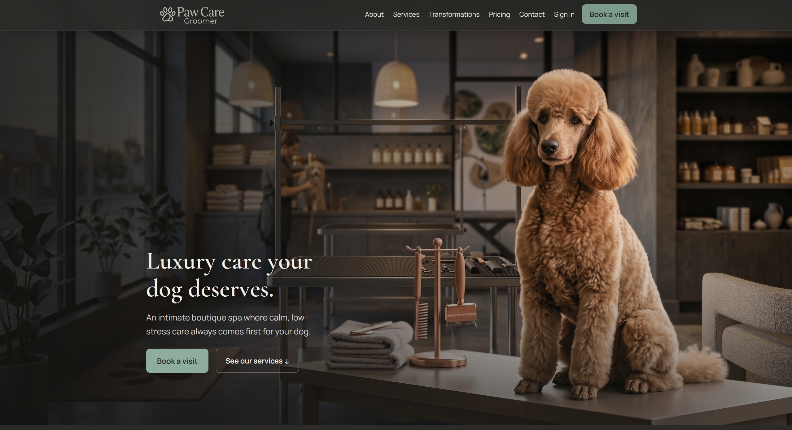
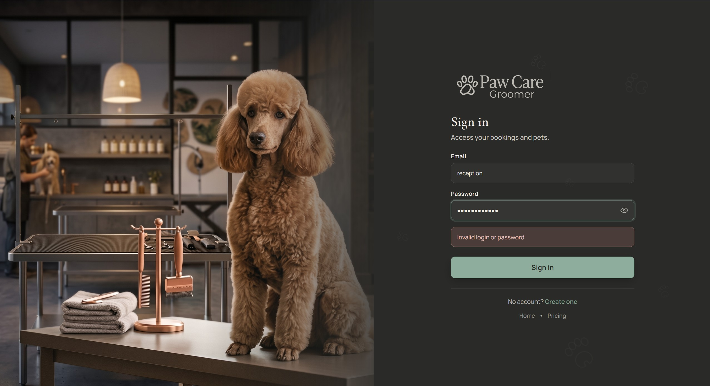
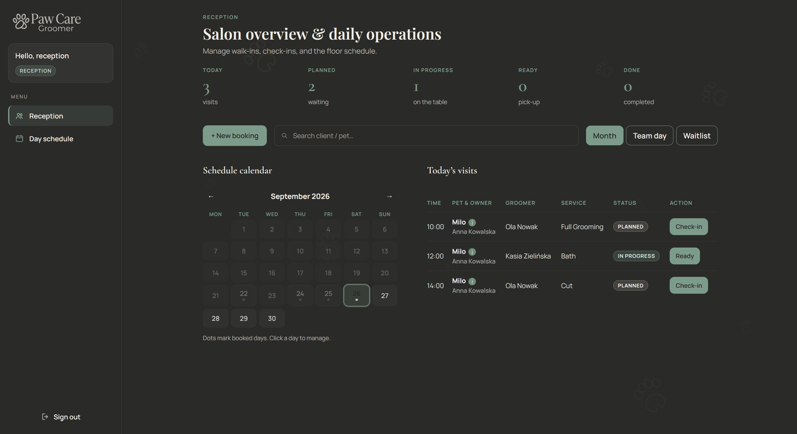
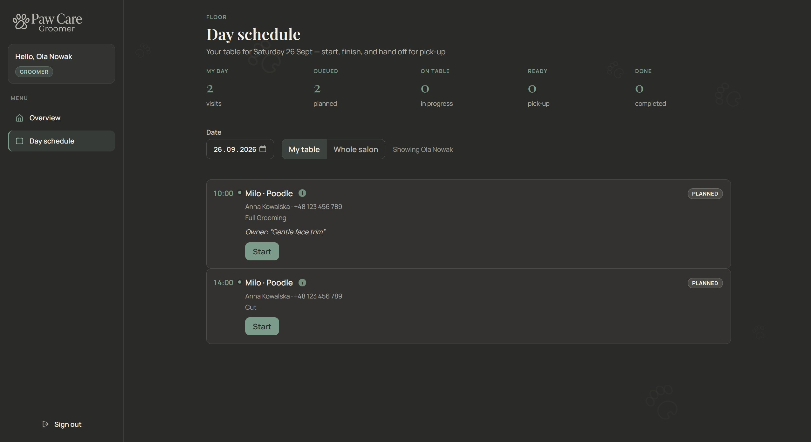
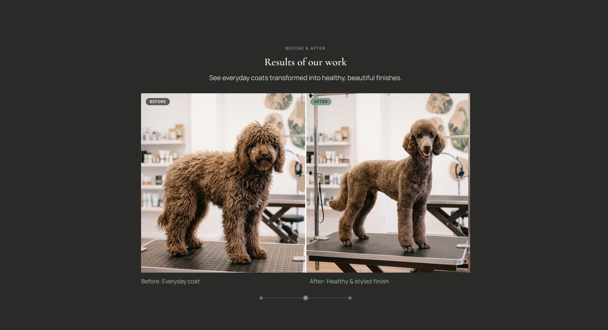
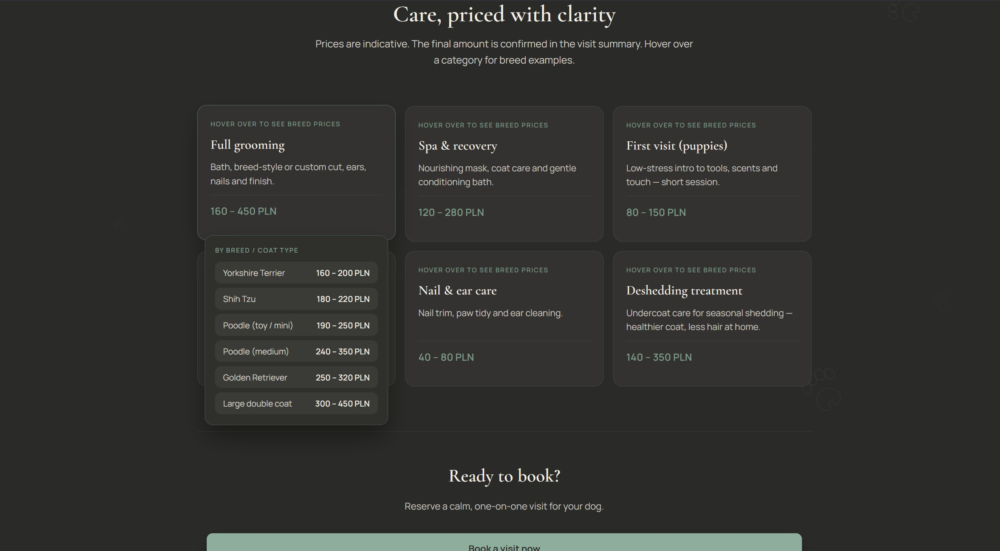
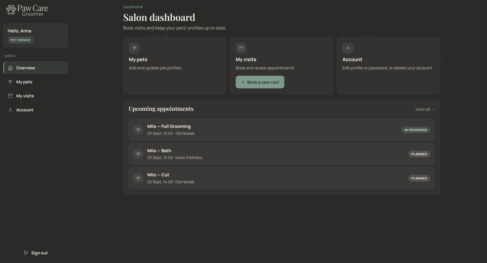

# Web Groomer App

Professional web application for a pet grooming salon (Spring Boot + React).

Successor to the university desktop project [groomer-salon-app](https://github.com/alexef360/groomer-salon-app).

## Stack

- Backend: Java, Spring Boot, JPA, Security, PostgreSQL
- Frontend: React + Vite
- Docker Compose for PostgreSQL

## Structure

- `backend/` — API
- `frontend/` — web UI

## Run (dev)

Default Spring profile is `dev` (see `application.properties`).

### Database

```bash
docker compose up -d
```

### Backend

```bash
cd backend
./mvnw spring-boot:run
```

### Frontend

```bash
cd frontend
npm install
npm run dev
```

## Screenshots

### Landing



### Sign in



### Reception desk



### Groomer day schedule



### Before & after



### Pricing



### Owner dashboard



## Security

Designed with a clear `dev` / `prod` split so the same codebase can run locally and in a production-like setup.

### Profiles and secrets

| Profile | Purpose |
|--------|---------|
| `dev` (default) | Local DB credentials and JWT secret in `application-dev.properties`; demo seed data |
| `prod` | No secrets in git — requires environment variables |

Production env vars:

- `DB_URL`
- `DB_USERNAME`
- `DB_PASSWORD`
- `JWT_SECRET` (at least 32 characters for HS256)
- `SPRING_PROFILES_ACTIVE=prod`

Demo users and price-list seed run only under `@Profile("dev")` (`DataInitializer`).

### Authentication and authorization

- Stateless **JWT Bearer** tokens (stored in the SPA `localStorage`)
- Passwords hashed with **BCrypt**; minimum length **8** on register and password change
- Role-based access: `ADMIN`, `RECEPTION`, `GROOMER`, `PET_OWNER`
- Pet owners are limited to `/api/me/**` with ownership checks on pets and visits
- Groomers see and update **only their own** visits; reception/admin retain full salon access

### Abuse protection and HTTP hardening

- Login rate limit: **5 failed attempts per IP per minute** → HTTP `429`
- Security headers: `X-Frame-Options: DENY`, `X-Content-Type-Options`, HSTS (for HTTPS deployments)
- H2 console is not exposed; CSRF is disabled for the Bearer-token API (sessionless)

## License

Proprietary — all rights reserved. Public for portfolio review only.  
Commercial use requires written permission.
